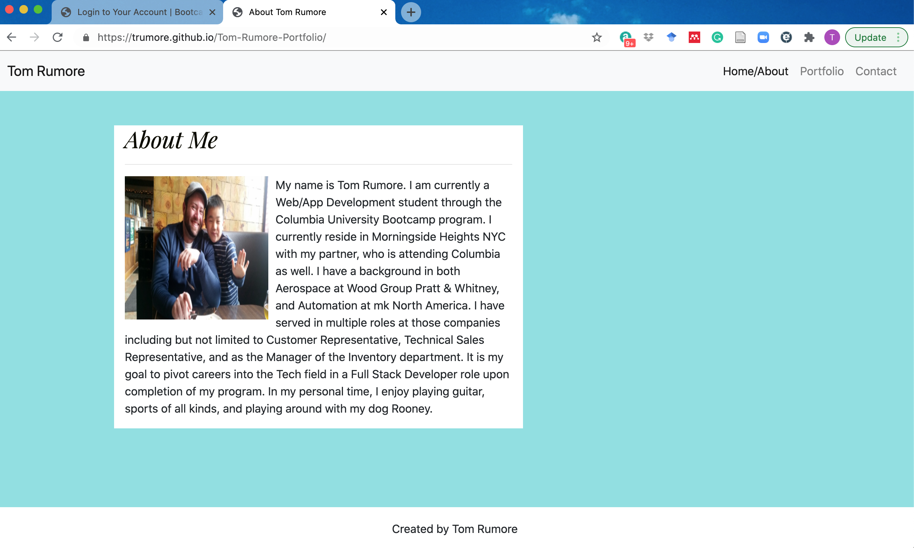
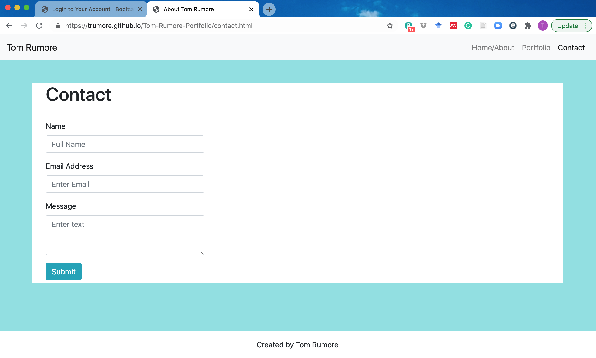

# Tom-Rumore-Portfolio

The motivation behind the creation of this project was to create a multi-page responsive portfolio. The intent being to create a jumping off point that will include both personal and professional information so that it may continuously be added to and changed as my expertise in coding evolves and I can include more detailed projects which I have built.

-Home/About - This page contains basic biographical information about myself
-Portfolio - This page contains some images of myself, my partner, and our dog Rooney
-Contact - This page has a contact box including a submit button, but is not courrently linked to any functionality per the instructions of the project.

Build Status: Ongoing

Code Style - coded using HTML and CSS

Screenshots:

Link to page: https://trumore.github.io/Tom-Rumore-Portfolio

Built with

- Bootstrap

Credits - Built by Tom Rumore and with collaboration with the CU-NYC-FSF-PT-10-2020-U-C Study Group
